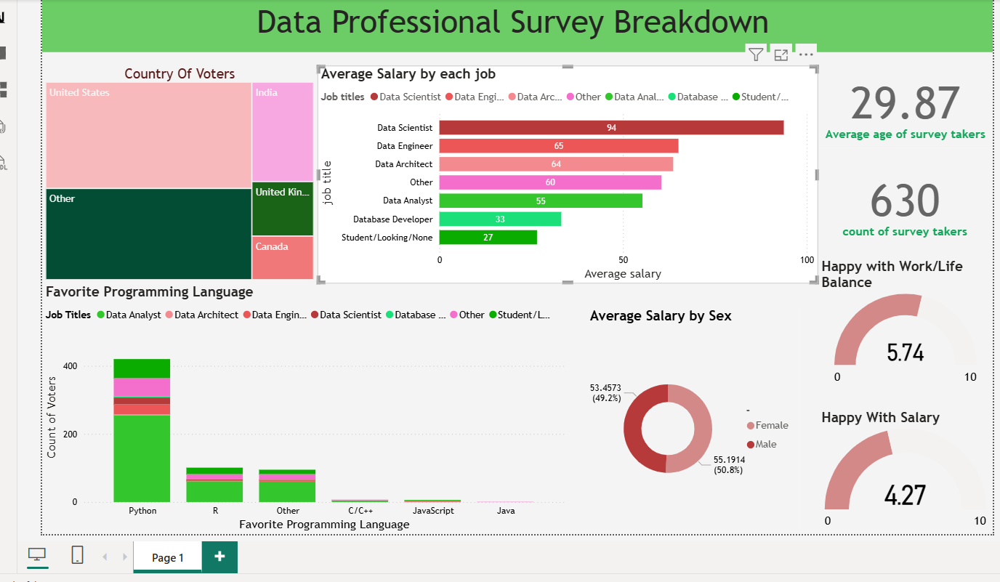

# Data Professional Survey Breakdown (Power BI & Excel)

این پروژه شامل یک داشبورد جامع و چندبعدی در **Power BI** است که به تحلیل وضعیت شغلی، مالی و دموگرافیک متخصصین حوزه داده می‌پردازد.

## ویژگی‌های کلیدی داشبورد:
- **تحلیل درآمد:** بررسی میانگین حقوق به تفکیک نقش‌های شغلی (Data Scientist, Analyst, Engineer).
- **محبوبیت زبان‌های برنامه‌نویسی:** نمایش میزان استفاده و علاقه به پایتون و سایر زبان‌ها.
- **شاخص‌های رضایت:** تحلیل دموگرافیک رضایت از بالانس کاری-زندگی و میزان حقوق بر اساس جنسیت و کشور.
- **پیش‌پردازش داده‌ها:** انجام فرآیند تمیزکاری و ETL روی داده‌های خام ورودی از اکسل.

## ابزارهای استفاده شده:
- Power BI Desktop
- Microsoft Excel (Data Cleaning)

## پیش‌نمایش داشبورد:

